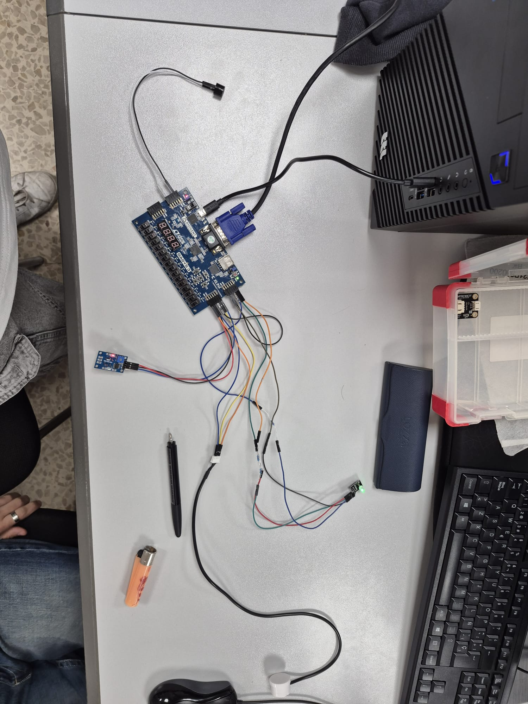
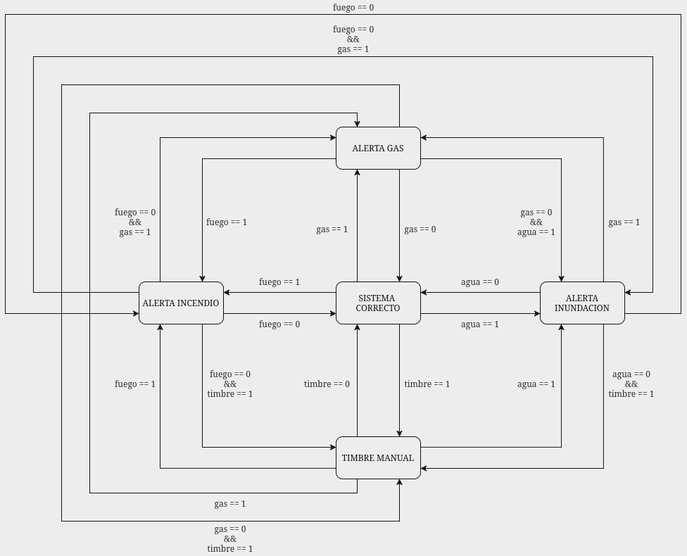

# SAMEI: Sistema de Alerta Multisensorial para Entornos Inclusivos

SAMEI es un sistema de alerta implementado sobre una FPGA. El sistema recibe señales procedentes de sensores o de interruptores de simulación y comunica el estado detectado mediante tres salidas: un altavoz, un LED RGB y una pantalla VGA.

El objetivo del proyecto es ofrecer una señalización redundante. Una alerta no depende únicamente de la información visual o acústica, sino que puede representarse simultáneamente mediante sonido, color y texto o gráficos en pantalla.

El diseño se ha realizado en VHDL utilizando Vivado e incluye simulación mediante un banco de pruebas.

## Demostración

[Ver el vídeo de demostración del sistema](https://drive.google.com/file/d/1C-ph-kSXQiD3uIve60K27gjJr0krNXgK/view?usp=sharing)

## Vista general

.png)

## Funcionamiento

El sistema puede trabajar con sensores físicos o con señales generadas mediante interruptores de simulación. La selección se realiza mediante la entrada `modo_simulacion`.

Las señales de los sensores se sincronizan con el reloj de la FPGA antes de enviarse al decodificador. El pulsador también se trata mediante un módulo independiente. A partir de estas entradas, el sistema determina el modo de funcionamiento y envía la información a los controladores de audio, LED RGB y VGA.

## Módulos VHDL

| Módulo | Responsabilidad |
| --- | --- |
| `sistema.vhd` | Módulo superior e integración del sistema. |
| `button.vhd` | Tratamiento de la entrada del pulsador. |
| `deco.vhd` | Decodificación de sensores y pulsador. |
| `motor_universal.vhd` | Generación de ticks a partir del reloj principal. |
| `clk_divider.vhd` | División de frecuencia. |
| `buzzer_ctrl.vhd` | Generación de tonos y patrones acústicos. |
| `rgb_ctrl.vhd` | Control del LED RGB según el modo seleccionado. |
| `vga.vhd` | Adaptación del reloj y conexión del subsistema VGA. |
| `vga_ctrl.vhd` | Control de la salida VGA. |
| `vga_sync.vhd` | Generación de sincronismos horizontal y vertical. |
| `vga_color_mapper.vhd` | Generación de los colores de la imagen. |
| `vga_font_engine.vhd` | Generación de caracteres y mensajes. |
| `test_sistema.vhd` | Banco de pruebas del sistema completo. |

## Entradas y salidas

### Entradas

| Señal | Anchura | Descripción |
| --- | ---: | --- |
| `clk` | 1 bit | Reloj principal de la FPGA. |
| `pulsador` | 1 bit | Activación manual de una alerta. |
| `sensor` | 3 bits | Señales procedentes de los sensores físicos. |
| `sw_sim` | 3 bits | Señales utilizadas en el modo de simulación. |
| `modo_simulacion` | 1 bit | Selección entre entradas físicas y simuladas. |

### Salidas

| Señal | Anchura | Descripción |
| --- | ---: | --- |
| `altavoz` | 1 bit | Señal generada para el altavoz o buzzer. |
| `led_rgb` | 3 bits | Control del LED RGB. |
| `vgaRed` | 4 bits | Componente roja de la salida VGA. |
| `vgaGreen` | 4 bits | Componente verde de la salida VGA. |
| `vgaBlue` | 4 bits | Componente azul de la salida VGA. |
| `Hsync` | 1 bit | Sincronismo horizontal de VGA. |
| `Vsync` | 1 bit | Sincronismo vertical de VGA. |

## Aspectos técnicos

### Sincronización de entradas

Las señales de los sensores proceden del exterior de la lógica sincronizada de la FPGA. Para evitar utilizar directamente una señal asíncrona en el resto del diseño, se emplean dos registros consecutivos:

```vhdl
if rising_edge(clk) then
    sensor_sync_1 <= sensor_elegido;
    sensor_sync_2 <= sensor_sync_1;
end if;
```

Esta estructura reduce el riesgo de metastabilidad antes de que la señal llegue al decodificador.

### Generación de frecuencias

El reloj principal se utiliza para generar señales de menor frecuencia. Estas señales permiten controlar los patrones de parpadeo del LED y la intermitencia de las alarmas acústicas.

El controlador del buzzer utiliza contadores para generar una onda cuadrada. El límite del contador cambia según el modo de alerta, produciendo tonos diferentes.

### Salida VGA

La salida VGA está dividida en varios bloques. `vga_sync.vhd` genera la temporización, los sincronismos y las coordenadas de los píxeles. `vga_color_mapper.vhd` determina el color que se muestra y `vga_font_engine.vhd` permite representar caracteres o mensajes.

## Simulación y validación

El banco de pruebas `test_sistema.vhd` genera un reloj de 10 ns y aplica una secuencia de estímulos al sistema:

- Estado inicial de reposo.
- Activación de una señal asociada al sensor de gas.
- Activación de una señal asociada al sensor de inundación.
- Cambio al modo de simulación.
- Simulación de una señal de fuego mediante los interruptores.
- Activación del pulsador manual.

La simulación permite comprobar el comportamiento integrado del módulo `sistema` antes de programar la placa.

## Material gráfico

### Esquema lógico


### Esquema físico


### Montaje físico



### Otra vista del montaje



Las imágenes de gran tamaño se conservan como material de referencia, pero no se muestran todas en esta página para mantener una lectura cómoda.

## Estructura del repositorio

```text
assets/
  Sistema de Alerta Multisensorial para Entornos Inclusivos (SAMEI).pdf
  Sistema de Alerta Multisensorial para Entornos Inclusivos (SAMEI).png
  imagenes/
    esquemas, fotografías y capturas del proyecto
project_final_26.srcs/
  sources_1/new/       código VHDL
  sim_1/new/           banco de pruebas
  constrs_1/           restricciones de pines
project_final_26.xpr   proyecto de Vivado
```

## Cómo abrir el proyecto

### Requisitos

- AMD/Xilinx Vivado compatible con el proyecto.
- La placa FPGA utilizada en la implementación.
- Cable de programación.
- Monitor VGA y los elementos externos utilizados durante la demostración.

### Pasos

1. Clonar el repositorio.
2. Abrir `project_final_26.xpr` desde Vivado.
3. Comprobar las fuentes situadas en `project_final_26.srcs/sources_1/new/`.
4. Revisar las restricciones de `Basys3_Master.xdc` y adaptarlas a la placa si fuera necesario.
5. Seleccionar `test_sistema.vhd` como entidad de simulación.
6. Ejecutar la simulación.
7. Ejecutar la síntesis y la implementación.
8. Generar el bitstream y programar la FPGA.


## Contexto y autoría

Proyecto académico realizado en equipo como parte de la asignatura PHR(programación hardware reconfigurable). Mario Reyes Morales actuó como responsable de coordinación del equipo. El trabajo se realizó de forma colaborativa, con una carga de trabajo aproximadamente equilibrada entre los participantes.

Participantes:

- Mario Reyes Morales
- Ruben Nuño Peña
- David Sanchez Sanchez
- Lucas Rojas Tena


